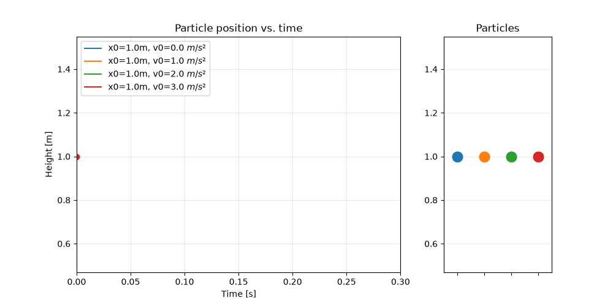

# neural_odes

A re-implementation of the NeuralODE paper

Usually in Machine Learning, the inputs and outputs of Neural Networks are quite clearly defined. For example, a plain-old feed forward MLP takes in some multi-dimensional input (like an image, or a bunch of real numbers) and produces multi-dimensional output (the dimension could also be 1). Transformers take in Sequences and output sequences. Even for something as crazy as AlphaFold, we can at least easily picture it as amino-acid sequence in -> 3d structure out.
Now, I am not talking about the Neural Networks themselves. They can be as complicated as you like and (at least for me), it is not trivial to even get a high-level picture of how the different layers and parts work together.
I am just talking about the inputs and outputs. But what happens if you can't even understand those?

I first came across the NeuralODE paper [https://arxiv.org/pdf/1806.07366] back in 2022 and understood nothing. Well maybe not nothing, I got the idea that it had to do with differential equations, which I am familiar with, but I did not really get what NeuralODEs exactly do and why we would need them. That did not change much after two more readings. I even had a class at university where NeuralODEs were discussed and where I finally thought I had understood, just to pretty much fail in the related exercise.

Some time passed and I came across (WDH) a video from Steven Brunton (whom I really like and who makes great videos on topics like optimization), talking about NeuralODEs. Nothing he said made any sense to me. It was like I "reverse learned" everything. I understood this already?! Why is it gone?

That's when I finally decided that I would never truly comprehend NeuralODEs without implementing them myself. And that's what this repo is for.

# Background

NeuralODE or Neural Ordinary Differential equations are not that different from the way we encounter Neural Networks in other places of the Machine Learning world. Neural Networks play a big role. Just how we use them is quite counterintuitive. Let me show you.

## ODEs

First, a quick recap. An ordinary differential equation (ODE) is a differential equation dependent on only a single (independent) variable [https://en.wikipedia.org/wiki/Ordinary_differential_equation]. A very simple ODE is Newton's second law:

$$
  F = ma
$$

The force is equal to mass times acceleration. More formally, if we equate acceleration as the second derivative of the position $x$ w.r.t. time, we get.

$$
  F = m \frac{d²x}{dt²}
$$

In general, the force can be dependent on the time and position as well, and we would usually write the dependent variable (the position x) on the left, leading to

$$
 m \frac{d²x}{dt²} = F(x, t)
$$

or 

$$
 \frac{d²x}{dt²} = \frac{F(x, t)}{m}
$$

if we bring the mass to the other side.

This is an ODE whose solutions would describe the motion of a particle under the force $F(x,t)$. To actually get solutions for real-world systems you want to model with your equations, you need initial conditions. Two in this case, because we have a second-order (two derivatives w.r.t. time) ODE. These are the initial position and initial velocity of the particle.

There are plenty of ways to solve ODEs and I don't want to even touch that topic here. In this very simple case, we could even solve it analytically (i.e. just integrating it) but in the usual case, one would use some numerical method.

An even simpler example for this already very simple setup is when the force $F(x,t)$ is constant. Say $9.81 \:N$, as it would be for a mass of $m=1\:kg$ in the earths gravitational field. The corresponding equation is then:

$$
 \frac{d²x}{dt²} = 9.81 \frac{m}{s²}
$$

For some particles dropped at the height of $1\:m$, with different initial velocities, we get solutions that look like:

Neat, right! The trajectories of the falling particles describe parabolas. We can quickly check if this makes sense by integrating the left hand side of the ODE twice w.r.t. time.
If we do that, the position $x$ turns out to be proportional to $t²$, hence the parabolic shape.

Great. The most general form we can write an ODE is:

$$
  \frac{dx(t)}{dt} = f(x(t), t, \theta)
$$

The dependet variable (also called state) is $x(t)$, the independent variable is time $t$. The evolution of the state $\frac{dx(t)}{dt}$ is governed by the function $f(x(t), t, \theta)$, which can depend on the state $x(t)$ itself, time explicitly and also some parameters $\theta$.